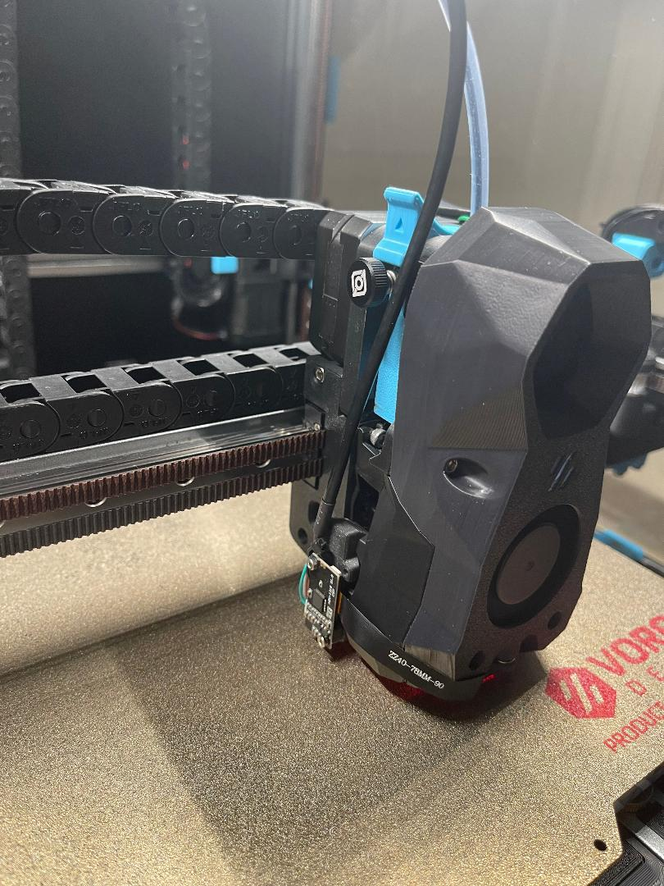
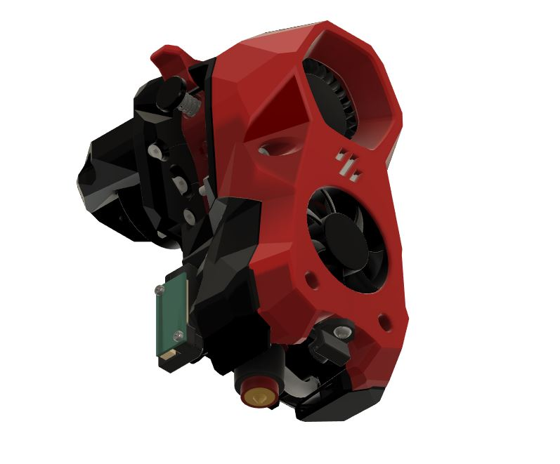
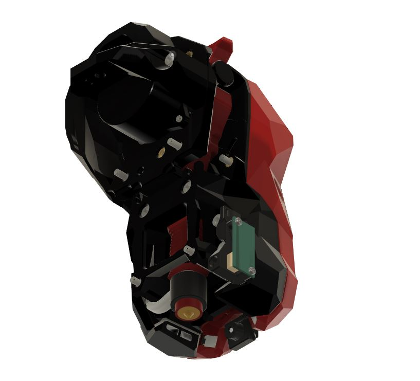

# CYCLOPS
This is a modded version of stealthburner for a nozzle camera.

***Under construction therefore not finalized. Currently assessing pathway for OV5640 camera FC.***

### Printing
  * Default voron settings
  * No supports needed

