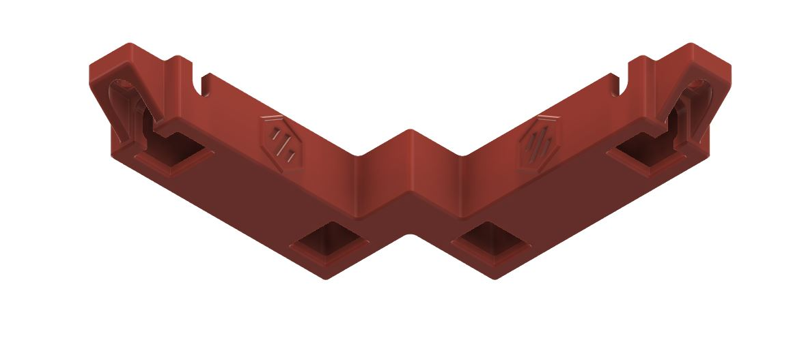
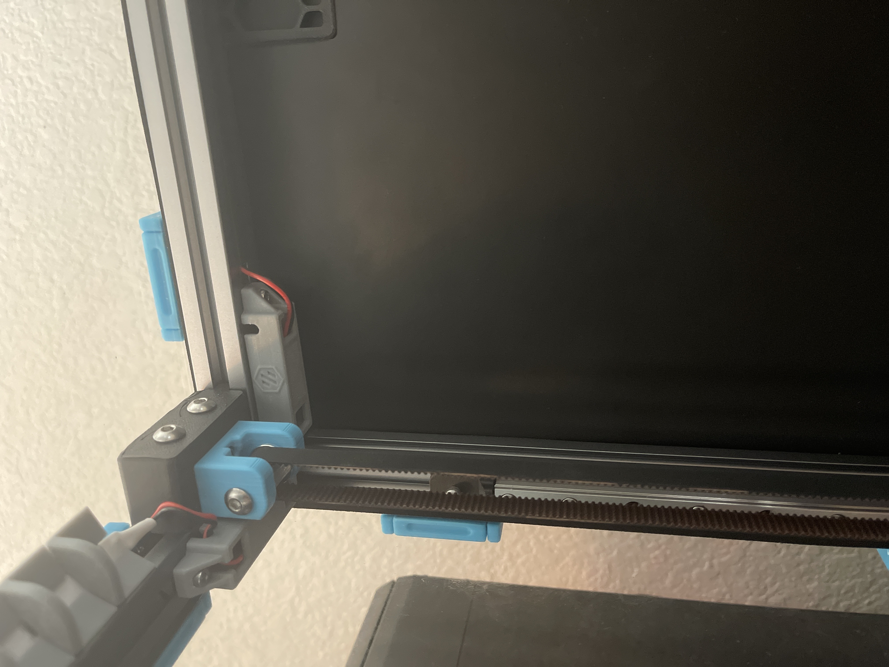

# Top Corner Cable Cover with Drop Down Holes (LED Wires)
Designed to hide cables that are running around the top corners of 2.4R2 extrusions behind the z idlers with drop down and inline holes of the extrusions3

Holes are big enough to allow 2 pin microfit connectors pass through. Works perfectly with LDO LED PCB breakout board.

**CAUTION**
Check your max Z travel as there will be some loss.

### Printing
  * Default voron settings
  * No supports needed

### BOM

Size | Qty
--- | ---
M3x8 | 8
M3 T-Nut | 8

